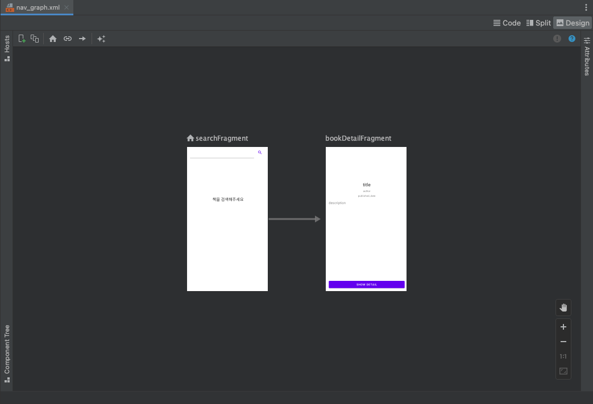

# Book Finder App
- 패키지명: com.illis.bookfinderapp
- 버전: v1.0.0
- 사용 언어: kotlin
- 프로젝트 설명, 기능:
  1. 책 이름을 검색하면 책 목록을 보여준다
     1. 책 결과를 검색하거나 하단으로 스크롤할 때 로딩 애니메이션이 동작한다.
     2. 화면을 회전하면 화면 크기에 맞게 책 목록의 레이아웃이 변경된다.
  2. 하단으로 스크롤 하면 다음 페이지 결과를 불러온다(Pagination)
  3. 아이템을 클릭하면 책의 상세 정보 화면으로 이동한다.
  4. 책 상세 화면에서 show detail 버튼을 클릭하면 책 preview 사이트로 이동한다.

## Feature
> ##### UI 구현
>  - 검색 결과 화면: SearchFragment.kt
>  - 책 상세 화면: BookDetailFragment.kt
>
| 검색 로딩                          | 검색 결과 화면                      | 페이지 로딩                       | 책 상세 화면                     | preview 사이트                  |
|--------------------------------|-------------------------------|------------------------------|-----------------------------|------------------------------|
|  |  |  |  |  |
> ##### 서버 연동
>  - Google Books API (https://www.googleapis.com/books/v1/volumes?startIndex=0&maxResults=10&q=안드로이드+intitle:안드로이드&orderBy=newest)
>    - 서버 연동: RetrofitInstance.kt
>      - remote: BookRepository.kt, BookRepositoryImpl.kt
>      - usecase: SearchUseCase.kt
>    - 서버 기타
>      - apis: BooksAPIService.kt
>      - 상수, 전역 변수: ServerConsts.kt
>      - 서버 예외 처리: ErrorInterceptor.kt
> ##### 비즈니스 로직
>  - __Search__
>    - 코드 : SearchViewModel.kt, SearchViewModelFactory.kt
>    - 비즈니스 로직 :
>      ```
>        interface SearchStep {
>            fun getBooks(searchText: String)
>            fun getNextPageBooks()
>        }
>      ```

## Structure
> ##### 프로젝트 구조 (사용한 dependency)
> - ``` java ```
>  - ``` com.illis.bookfinderapp ```
>     - ``` consts ``` : 상수 및 전역 변수
>     - ``` data ```
>       - ``` api ``` : Google 서버 API 사용 규격 인터페이스
>       - ``` interceptor ``` : 서버 예외 처리 클래스
>       - ``` model ``` : Books 데이터 모델 클래스
>       - ``` repository ``` : 서버 연동 & view에 데이터 전달 구현 클래스
>     - ``` domain ```
>       - ``` repository ``` : view에 데이터를 전달하기 위한 규격 인터페이스
>       - ``` usecase ``` : 비즈니스 로직
>     - ``` presentation ``` : 화면 처리
>
> ##### View 구조
> : Single Activity, Navigation UI
> ##### Architecture
> : Clean Architecture, MVVM

## Environments
> - AGP Version (gradle-wrapper.properties): 7.4
> - Build Gradle Version (build.gradle): 7.3.1
>- Sdk Version: minSdkVersion 26, compileSdkVersion 32

## Open Source Dependencies
> ##### view
>  - 'com.google.android.flexbox:flexbox:3.0.0': 리사이클러뷰 레이아웃 매니저 (양쪽 정렬)
>  - "androidx.navigation:navigation-fragment-ktx:2.5.3": 화면 전환
>  - "com.github.bumptech.glide:glide:4.14.2": 이미지 load
> ##### 데이터 저장 및 관리
>  - "org.jetbrains.kotlinx:kotlinx-coroutines-android:1.6.4": 경량 비동기 처리
>  - "androidx.lifecycle:lifecycle-viewmodel-ktx:2.5.1": 생명 주기에 따라 데이터를 저장하고 변화를 관찰
>  - "androidx.lifecycle:lifecycle-livedata-ktx:2.5.1": 생명 주기에 따라 데이터를 저장하고 변화를 관찰
> ##### 서버 연동
>  - 'com.squareup.retrofit2:retrofit:2.9.0': 서버 통신 지원
>  - 'com.squareup.okhttp3:okhttp:5.0.0-alpha.6': 서버 통신 지원
>  - 'com.squareup.okhttp3:logging-interceptor:4.10.0': 서버 통신 로깅 툴

## Documents
- 원격 저장소: https://github.com/12121s/kotlin-book-finder-app

## Screen Shots
- 전체 화면 flow (nav_graph.xml)
  